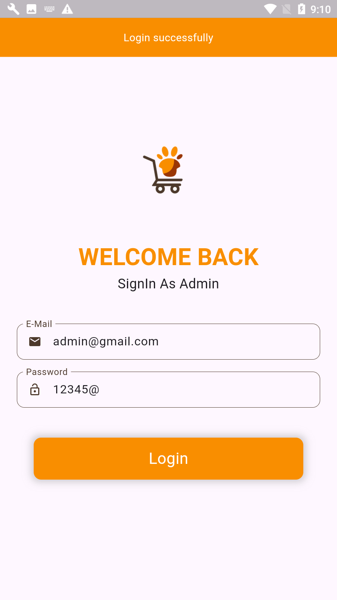
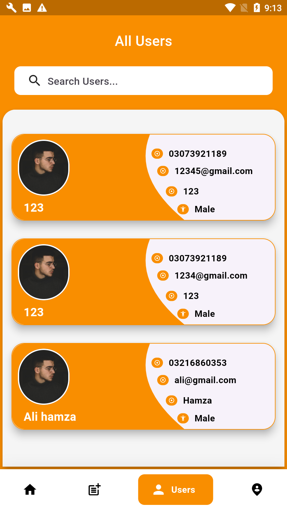
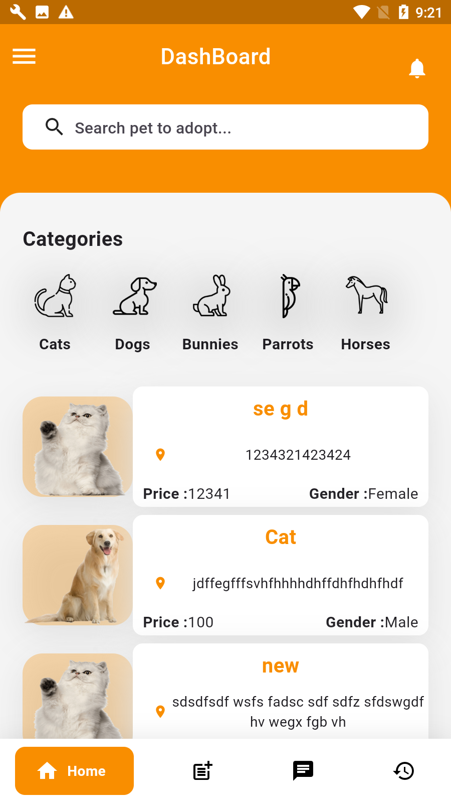
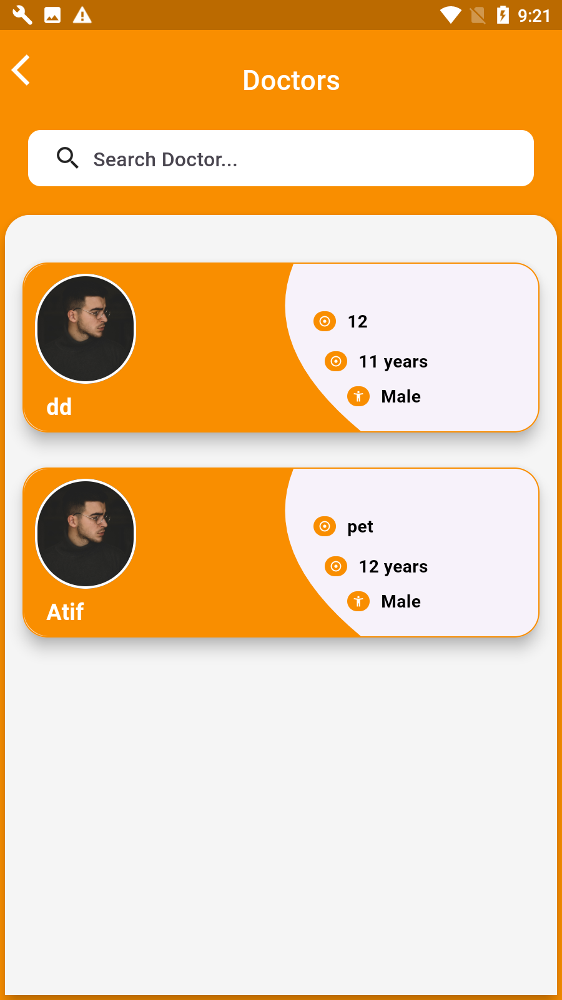

<div align="center">
  <h1>
    <br/>
    Pet Shop - Complete Pet Care Solution
  </h1>
  <h3>A Modern Pet Care Application with Admin, Doctor, and User Portals</h3>
</div>

<p align="center">
    
    
    
</p>

## 📸 Banner
<p align="center">
    
</p>

## 📌 Overview

Pet Shop is a comprehensive pet care application built with Flutter, designed to connect pet owners with veterinary doctors. The app features three distinct portals - Admin, Doctor, and User - each with specialized functionalities to ensure complete pet care management.

## 🚀 Tech Stack

- **Flutter** (UI Framework)
- **Firebase** (Authentication & Database)
- **Cloud Firestore** (Data Storage)
- **Firebase Storage** (Media Storage)
- **Material Design 3**
- **Custom Animations**

## 🔑 Key Features

### Admin Portal
- ✅ **User Management**: View and manage all users
- ✅ **Doctor Management**: View and manage all doctors
- ✅ **Pet Management**: Add and manage pets
- ✅ **Post Management**: Monitor pet care posts
- ✅ **Detailed Analytics**: View detailed statistics

### Doctor Portal
- ✅ **Dashboard**: Overview of appointments and patients
- ✅ **Post Creation**: Share pet care tips and advice
- ✅ **Patient Management**: View and manage pet details
- ✅ **Messaging System**: Communicate with pet owners
- ✅ **Appointment Management**: Handle booking requests

### User Portal
- ✅ **Dashboard**: Overview of pets and appointments
- ✅ **Doctor Search**: Find and connect with veterinarians
- ✅ **Post Creation**: Share pet experiences
- ✅ **Messaging System**: Chat with doctors
- ✅ **Pet Management**: Add and manage pets
- ✅ **Appointment Booking**: Schedule vet visits

## 📸 Screenshots

### Splash & Onboarding

<table border="1">
  <tr>
    <td align="center">
      
      <p><b>Splash Screen</b></p>
    </td>
    <td align="center">
      
      <p><b>Walkthrough 1</b></p>
    </td>
    <td align="center">
      
      <p><b>Walkthrough 2</b></p>
    </td>
  </tr>
  <tr>
    <td align="center">
      
      <p><b>Walkthrough 3</b></p>
    </td>
    <td align="center">
      
      <p><b>Loading Screen</b></p>
    </td>
  </tr>
</table>

### Admin Portal

<table border="1">
  <tr>
    <td align="center">
      
      <p><b>Admin Login</b></p>
    </td>
    <td align="center">
      
      <p><b>All Users</b></p>
    </td>
    <td align="center">
      
      <p><b>All Doctors</b></p>
    </td>
  </tr>
  <tr>
    <td align="center">
      
      <p><b>Add Pet</b></p>
    </td>
    <td align="center">
      
      <p><b>Pet Care Posts</b></p>
    </td>
    <td align="center">
      
      <p><b>Detail Page</b></p>
    </td>
  </tr>
</table>

### Doctor Portal

<table border="1">
  <tr>
    <td align="center">
      
      <p><b>Doctor Login</b></p>
    </td>
    <td align="center">
      
      <p><b>Doctor Signup</b></p>
    </td>
    <td align="center">
      
      <p><b>Doctor Signup 2</b></p>
    </td>
  </tr>
  <tr>
    <td align="center">
      
      <p><b>Doctor Dashboard</b></p>
    </td>
    <td align="center">
      
      <p><b>Add Post</b></p>
    </td>
    <td align="center">
      
      <p><b>Pet Detail</b></p>
    </td>
  </tr>
  <tr>
    <td align="center">
      
      <p><b>Doctor Inbox</b></p>
    </td>
    <td align="center">
      
      <p><b>Message Screen</b></p>
    </td>
    <td align="center">
      
      <p><b>My Posts</b></p>
    </td>
  </tr>
</table>

### User Portal

<table border="1">
  <tr>
    <td align="center">
      
      <p><b>User Login</b></p>
    </td>
    <td align="center">
      
      <p><b>User Signup</b></p>
    </td>
    <td align="center">
      
      <p><b>User Dashboard</b></p>
    </td>
  </tr>
  <tr>
    <td align="center">
      
      <p><b>Navigation Drawer</b></p>
    </td>
    <td align="center">
      
      <p><b>Doctors List</b></p>
    </td>
    <td align="center">
      
      <p><b>Pet Care</b></p>
    </td>
  </tr>
  <tr>
    <td align="center">
      
      <p><b>Add Post</b></p>
    </td>
    <td align="center">
      
      <p><b>My Posts</b></p>
    </td>
    <td align="center">
      
      <p><b>User Inbox</b></p>
    </td>
  </tr>
  <tr>
    <td align="center">
      
      <p><b>Message Page</b></p>
    </td>
  </tr>
</table>

## Project Structure

```
lib/
├── src/
│   ├── admin/
│   │   ├── screens/
│   │   │   ├── login_screen.dart
│   │   │   ├── dashboard_screen.dart
│   │   │   ├── users_screen.dart
│   │   │   ├── doctors_screen.dart
│   │   │   └── pets_screen.dart
│   │   └── widgets/
│   ├── doctor/
│   │   ├── screens/
│   │   │   ├── login_screen.dart
│   │   │   ├── signup_screen.dart
│   │   │   ├── dashboard_screen.dart
│   │   │   ├── posts_screen.dart
│   │   │   └── messages_screen.dart
│   │   └── widgets/
│   ├── user/
│   │   ├── screens/
│   │   │   ├── login_screen.dart
│   │   │   ├── signup_screen.dart
│   │   │   ├── dashboard_screen.dart
│   │   │   ├── doctors_screen.dart
│   │   │   ├── posts_screen.dart
│   │   │   └── messages_screen.dart
│   │   └── widgets/
│   └── core/
│       ├── constants/
│       ├── services/
│       └── utils/
└── main.dart
```

## 👥 Contributors

<table>
  <tr>
    <td align="center">
      <br/>
      <b>jamalihassan0307</b>
    </td>
    <td align="center">
      <br/>
      <b>Atif Imtiaz</b>
    </td>
  </tr>
</table>

## 🎯 Features Coming Soon

- Video consultations
- Pet health tracking
- Medication reminders
- Pet insurance integration
- Emergency services
- Multi-language support
- Pet adoption services

## 🔧 Settings & Customization

- Profile customization
- Notification preferences
- Privacy settings
- Theme options
- Language selection
- Data backup options

## 📖 How to Use

1. **Admin Portal**
   - Login with admin credentials
   - Manage users and doctors
   - Monitor pet care posts
   - View analytics and reports

2. **Doctor Portal**
   - Register as a doctor
   - Manage appointments
   - Create pet care posts
   - Communicate with pet owners

3. **User Portal**
   - Register as a user
   - Add your pets
   - Find and connect with doctors
   - Share pet care experiences
   - Book appointments

## 📝 License

This project is licensed under the MIT License - see the LICENSE file for details.
